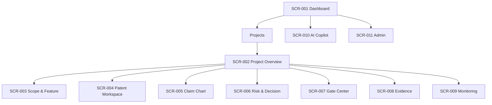

# 09. 정보구조도(IA)

## 1. 문서 정보
- 프로젝트: 설계특허관리 웹앱 (Design Patent/FTO Management Platform)
- 기준일: 2026-08-25
- 상태: Draft v0.1
- 근거: 제공된 특허업무/기술특허 관리 가이드 및 Phase 문서 작성 가이드

## 2. 목적
업무 흐름과 데이터 탐색을 반영한 메뉴/콘텐츠 구조를 정의한다.

## 3. 범위
설계특허관리 웹앱

## 공통 사전

### 역할
| 코드 | 역할 | 주요 권한 |
|---|---|---|
| ROLE-RND | R&D/설계자 | Feature/설계안/Evidence 등록, 회피설계 수행 |
| ROLE-PM | 제품/프로젝트 관리자 | 프로젝트·Gate·일정·범위 관리 |
| ROLE-IP | IP 담당 | 검색, 특허 선별, Claim Chart, Risk 평가 |
| ROLE-LEGAL | 법무/변리사 | 법률 검토, Critical/High 승인 |
| ROLE-QA | 시험/품질 | 시제품·시험 Evidence, 변경 영향 검증 |
| ROLE-EXEC | 의사결정자 | 출시/라이선스/중단 등 최종 Business Decision |
| ROLE-ADMIN | 시스템 관리자 | 기준정보·권한·연동·감사 설정 |

### ID 규칙
`BR-xxx / FR-xxx / NFR-xxx / FS-xxx / US-xxx / UC-xxx / SCR-xxx / API-<DOMAIN>-xxx / TBL-<DOMAIN>-xxx / PG-xxx / TC-xxx / ASM-xxx / RSK-xxx`

### 핵심 상태값
- Project: DRAFT → ACTIVE → ON_HOLD → CLOSED
- Patent Review: CANDIDATE → SCREENED → CLAIM_ANALYSIS → LEGAL_REVIEW → DECIDED → MONITORING
- Risk: CRITICAL / HIGH / MEDIUM / LOW / CLEARED
- Gate: NOT_STARTED / IN_REVIEW / PASSED / CONDITIONAL / REJECTED
- Decision: DESIGN_AROUND / LICENSE / INVALIDITY_REVIEW / ACCEPT / STOP / MONITOR

### API Prefix
`/api/v1`

### 환경/서비스
`DEV / STG / PRD`, 서비스명 `web`, `api`, `worker`, `ai-gateway`, `search`, `db`, `object-storage`, `audit`

## 5. IA

### 글로벌 탐색
- Dashboard
- Projects
- Patent Search/Workspace
- Tasks/Approvals
- Monitoring
- Reports
- Admin

### 프로젝트 내부 탭
Overview / Scope / Features & Revisions / Patents / Claim Charts / Risks & Decisions / Gates / Evidence / Activity

## 가정 및 확인 필요 사항

| ID | 항목 | 현재 가정 | 근거 | 상태 |
|---|---|---|---|---|
| ASM-001 | 조직 | 중견 전자 제조사 R&D/IP 협업 환경 | 제공 가이드의 대상 조직 | 확인 필요 |
| ASM-002 | 인증 | 사내 SSO(OIDC/SAML) + 애플리케이션 RBAC | 인증 상세 미제공 | 확인 필요 |
| ASM-003 | 배포 | Private Cloud 또는 VPC 기반 웹앱 | 특허/설계 비밀정보 보호 필요 | 확인 필요 |
| ASM-004 | 특허 데이터 | KIPRIS/WIPO/EPO/USPTO 및 상용 DB 연계 가능 구조 | 제공 가이드의 검색 DB | 확인 필요 |
| ASM-005 | AI | AI는 검색·분류·요약·Claim Chart 초안 보조만 수행 | 최종 법률 판단은 전문가 검토 필요 | 적용 |
| ASM-006 | PLM 연동 | 제품/설계 Rev, BOM, ECO/ECN 메타데이터 연계 | 설계변경 재검토 필요 | 확인 필요 |
| ASM-007 | MVP 국가 | KR/US 우선, 다국가 확장 가능 | 구체 사업국가 미제공 | 확인 필요 |
| ASM-008 | 법률판단 | FTO/침해 최종 판단은 IP/법무/변리사 승인 | 가이드 원칙 | 적용 |

## 9. 완료 기준
기능명세서의 모든 기능이 IA에 배치됨.
